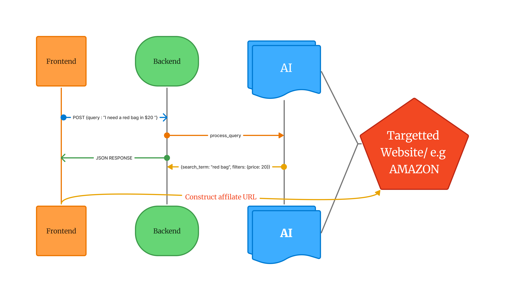

# Voice Search Demo Project

This is a voice search demo project built using Python and Flask. The application allows users to perform product searches using either text or voice input. It leverages Flask for the backend, Flask-CORS for handling cross-origin requests, and the `speech_recognition` library for processing audio input.

## Features

- **Voice Search**: Users can upload audio files, which are processed to extract the search query.
- **Text Search**: Users can directly input text queries for product searches.
- **AI-Powered Search**: The application uses a custom `ProductSearchAI` class to process search queries and return results.
- **Dynamic Templates**: The application uses Flask templates for rendering the main search page.
- **Cross-Origin Support**: Enabled via Flask-CORS for seamless integration with frontend applications.

## Project Structure

- `app.py`: The main application file containing all routes and logic.
- `templates/`: Directory for HTML templates (e.g., `index.html`).
- `product_search_ai.py`: A custom module for handling AI-based product search logic (not included in this repository).

## API Endpoints

### 1. Home Page
**URL**: `/`  
**Method**: `GET`  
**Description**: Renders the main search page.

### 2. Search API
**URL**: `/api/search`  
**Method**: `POST`  
**Description**: Processes text-based search queries.  
**Request Body**: 
```json
{
  "query": "search term"
}
```
**Response**: 
```json
{
  "results": [
    {
      "name": "Product Name",
      "description": "Product Description",
      "price": 19.99
    }
  ]
}
```
### 3. Voice Search API
**URL**: `/api/voice_search`
**Method**: `POST`
**Description**: Processes audio files for voice-based search queries.
**Request Body**:
```json
{
  "audio": "base64_encoded_audio_file"
}
``` 
**Response**:
```json
{
  "results": [
    {
      "name": "Product Name",
      "description": "Product Description",
      "price": 19.99
    }
  ]
}
```

## Installation
1. Clone the repository:
   ```bash
   git clone
    cd voice-search-demo
    ```
2. Install the required packages:
    ```bash
    pip install -r requirements.txt
    ```
3. Run the application:
    ```bash 
    python app.py
    ```
4. Open your web browser and navigate to `http://localhost:5000`.
5. Use the search bar to perform text or voice searches.
6. For voice search, upload an audio file containing your search query.
7. The application will process the audio and return relevant product search results.
## Dependencies
- Flask
- Flask-CORS
- SpeechRecognition
- requests
- numpy


#Basic Graph



